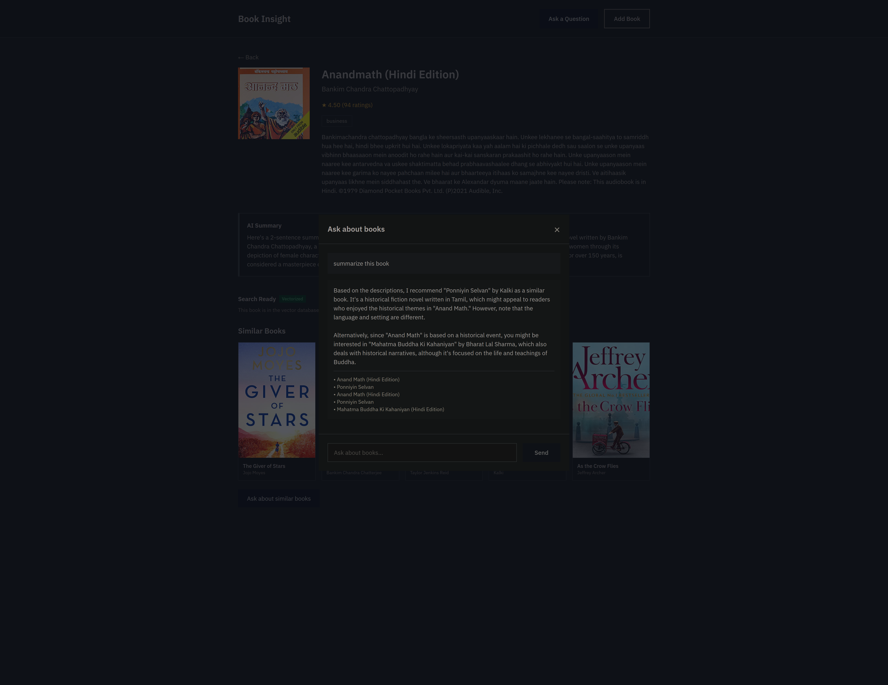

# Book Insight Explorer

A book recommendation system with a Q&A feature that uses AI to answer questions about books.




## Quick Start

### Prerequisites

- Python 3.9+
- Node.js 18+
- MySQL 8.0+

### Setup

1. **Backend**
   ```bash
   cd backend
   cp .env.example .env  # Configure MySQL and GROQ_API_KEY
   pip install -r requirements.txt
   python manage.py migrate
   python manage.py loaddata books_backup.json
   python manage.py embed_books
   python manage.py runserver
   ```

2. **Frontend**
   ```bash
   cd frontend
   npm install
   npm run dev
   ```

3. Visit `http://localhost:5173`

## Project Structure

```
├── backend/     # Django REST API
├── frontend/    # React + Tailwind
├── media/      # Screenshots
└── README.md   # This file
```

## Tech Stack

- **Backend:** Django, DRF, MySQL, ChromaDB
- **Frontend:** React, Tailwind CSS
- **AI:** Groq (Llama 3), sentence-transformers
- **Scraping:** Selenium

## What Was Hard

### Scraping
Started with Open Library - got blocked hard by captchas. Switched to Audible India but selectors kept changing, lost about 30% of books to various failures.

### AI Costs
Originally generated summaries for all books upfront - costly. Switched to on-demand generation when someone first views a book detail page.

### Vector Search
ChromaDB works but had issues with duplicates (fixed with Django signals) and search quality inconsistency.

## What Doesn't Work Great

- Search falls back to text when vectors fail
- Recommendations just match subjects exactly
- No pagination - returns all books
- Chat history doesn't persist across reloads